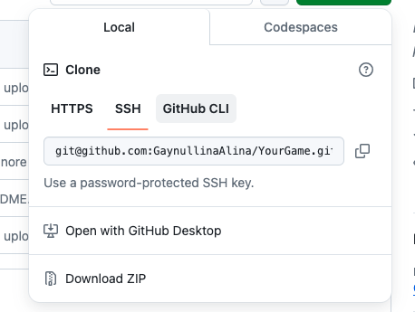
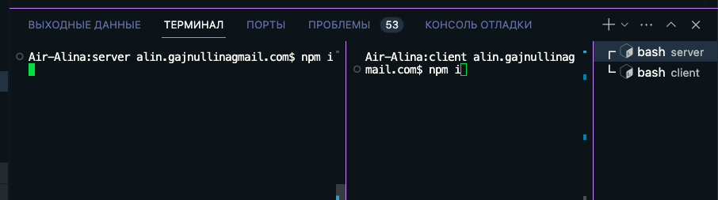
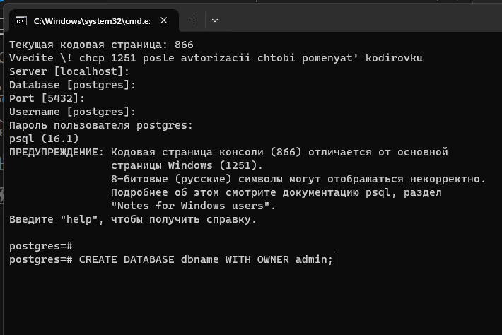
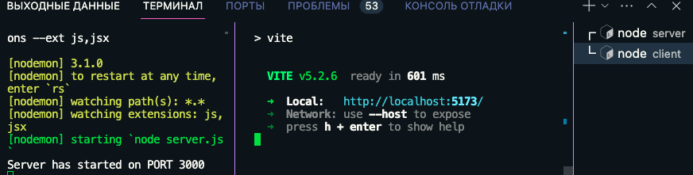

# Своя игра

Чтобы запустить проект:

1.скачайте репозиторий, используя SSH-ключ или любыми другими доступными способами;

2.откройте папку проекта в VSCode;

3.откройте терминал, перейдите в папки server и client, введя команды cd server и cd client соответственно,  и введите команду npm i для каждой поддиректории;

4.при помощи SQL-shell, DBeaver или других программ создайте пустую базу данных, запомните ее название, имя пользователя и пароль;

5.В поддериктории server создайте файл .env , отредактируйте содержимое ориентируясь на содержимое файла .env_example:

6.Проинициализируйте базу данных, введя в терминал команду npm run initdb;

7.После успешной инициализации запустите проект в каждом терминале  командой npm run dev;

8.Переходите по ссылке, которая высветится в консоли и вперед на сайт!

